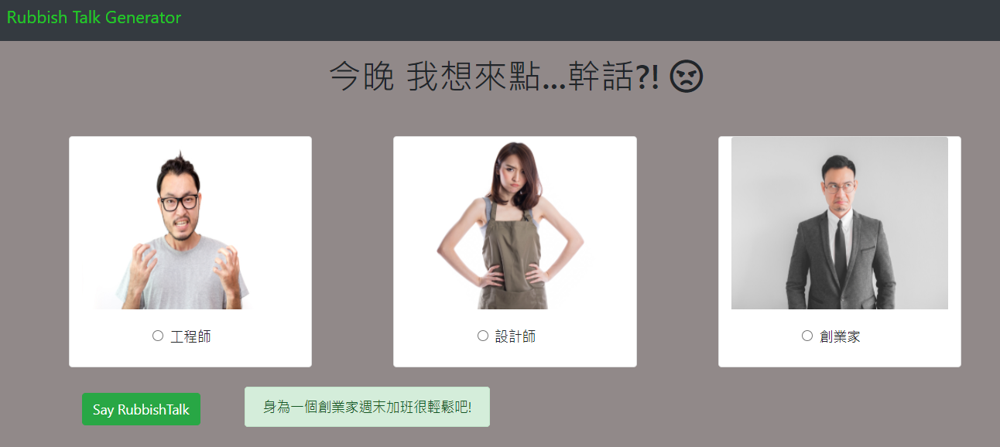

# Rubbish Talk Generator
壓力大時就來這裡解放~
對你的「工程師、設計師、創業家」好朋友們說幹話吧!

## Features - 產品功能
1. 使用者可選取任一職業
2. 再點擊"Say Rubbish"按鈕，隨機產生一組幹話

## Installing - 專案安裝流程
1. 開啟終端機，執行以下指令 :
> `git clone https://github.com/KarolChang/rubbish_talk_generator.git`

2. 進入專案資料夾
> `cd rubbish_talk_generator`

3. 安裝 npm & 透過 npm 安裝以下套件
> `npm install`
> `npm i express express-handlebars body-parser`

4. 安裝nodemon
> `npm install -g nodemon`

5. 啟動專案
> `nodemon app.js`
> 在瀏覽器進入 http://localhost:3000

## Environment & Tools - 環境&使用工具
* [Visual Studio Code編輯器](https://code.visualstudio.com/)
* [Node.js (v10.15.0)](https://nodejs.org/en/)
* [express框架](https://www.npmjs.com/package/express)
* [express handlebars模板引擎](https://www.npmjs.com/package/express-handlebars)
* [body-parser](https://www.npmjs.com/package/body-parser)

